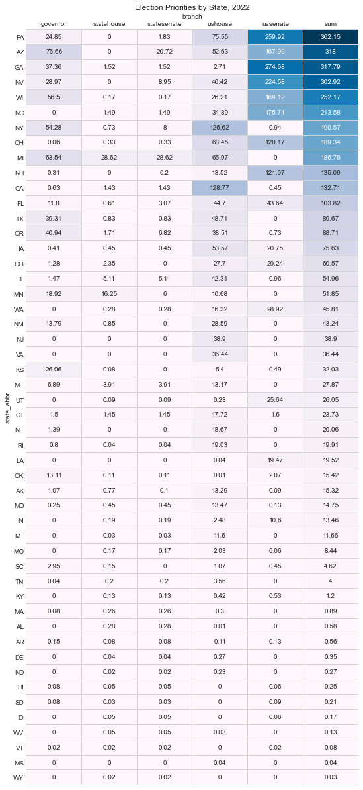

# elections-meta

This repo holds the code and data for my model of the 2020 and 2022 elections. I pull together forecasts for elections at all levels of government, and then combine them using a power sharing model that emphasized tipping point seats and close elections. 

Here's an example heatmap of the final results by state for 2020, see my [blogpost](https://pstblog.com/2020/09/09/elections-meta) on the topic for more details:

 

